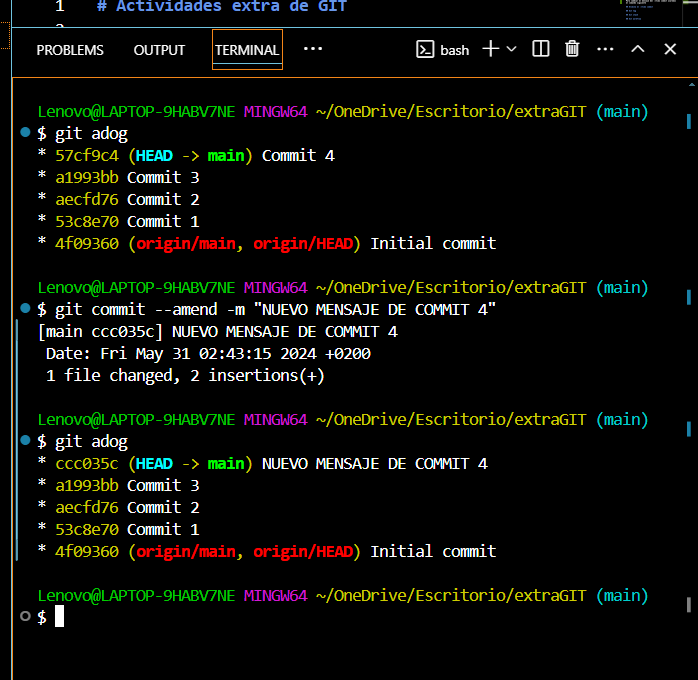
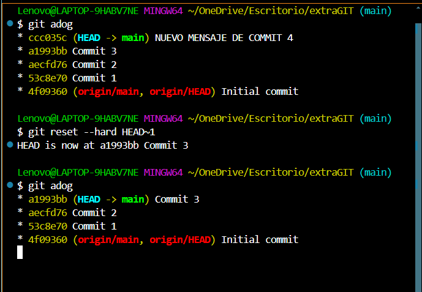
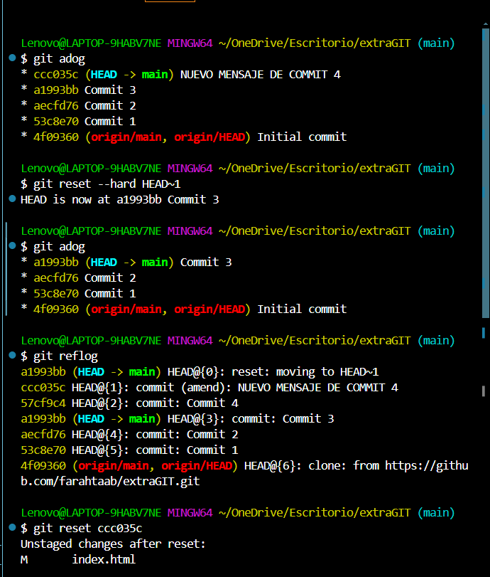
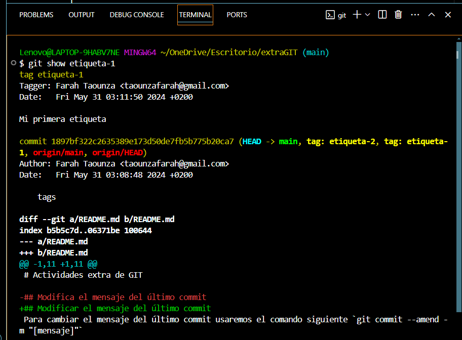
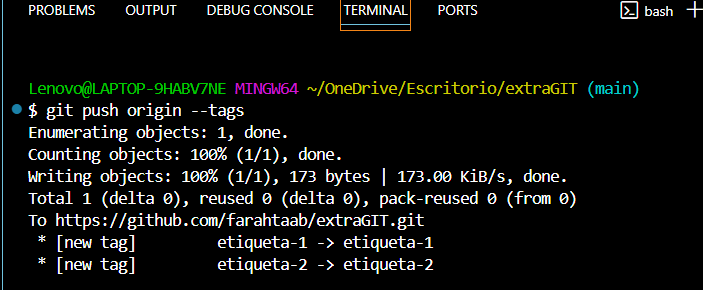
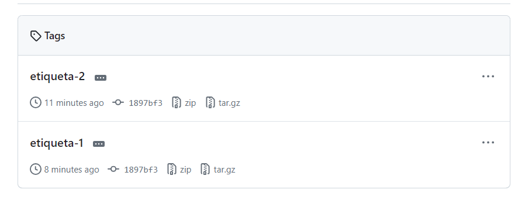
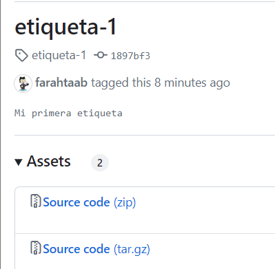
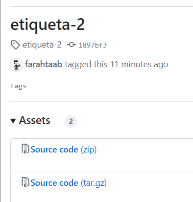

# Actividades extra de GIT

## Modificar el mensaje del último commit
Para cambiar el mensaje del último commit usaremos el comando siguiente `git commit --amend -m "[mensaje]"`

## Eliminar el último commit 
Tenemos varias opciones:
| **Comando**                      | **Descripción**                                                                                               | **Consideraciones**                                                                                     |
|----------------------------------|---------------------------------------------------------------------------------------------------------------|---------------------------------------------------------------------------------------------------------|
| `git reset --soft HEAD~1`        | Deshace el último commit pero mantiene los cambios en el área de preparación (staging area).                   | No afecta los archivos en tu directorio de trabajo. Útil si quieres modificar el commit antes de hacerlo de nuevo.  |
| `git reset --hard HEAD~1`        | Deshace el último commit y elimina los cambios realizados en ese commit.                                       | Elimina permanentemente los cambios del último commit. Úsalo con precaución.                            |
| `git revert HEAD`                | Crea un nuevo commit que revierte los cambios del último commit.                                               | Seguro para usar en commits ya publicados en un repositorio remoto. No altera el historial de commits.  |

Usaremos la siguiente `git reset --hard HEAD~1`

## Recuperar el último commit eliminado

## Git tag
## Comandos para Etiquetas (Tags)

Las etiquetas son útiles para marcar puntos específicos en el historial del proyecto, como versiones de lanzamiento. 

#### Tipos de etiquetas
- Etiquetas livianas (lightweight tags): Son simplemente referencias a un commit específico. No contienen información adicional como el nombre del creador o la fecha de creación.

- Etiquetas anotadas (annotated tags): Contienen metadatos adicionales, como el nombre del creador, la fecha, un mensaje de la etiqueta, y pueden ser firmadas con una clave GPG para mayor seguridad.

* Aquí están los comandos para trabajar con etiquetas:

| Comando                                    | Descripción                                                                                                   |
|--------------------------------------------|---------------------------------------------------------------------------------------------------------------|
| `git tag`                                  | Muestra la lista de etiquetas en el repositorio.                                                              |
| `git tag [nombre_etiqueta]`                | Crea una nueva etiqueta ligera con el nombre especificado.                                                    |
| `git tag -a [nombre_etiqueta] -m "[mensaje]"` | Crea una nueva etiqueta anotada con el nombre y mensaje especificados.                                         |
| `git push origin [nombre_etiqueta]`        | Sube la etiqueta especificada al repositorio remoto.                                                          |
| `git push origin --tags`                   | Sube todas las etiquetas al repositorio remoto.                                                               |
| `git tag -d [nombre_etiqueta]`             | Elimina la etiqueta especificada localmente.                                                                  |
| `git push origin :refs/tags/[nombre_etiqueta]` | Elimina la etiqueta especificada en el repositorio remoto.                                                     |

Haremos lo siguiente:

    *Crearemos 2 etiquetas una con mensaje (anotada) y otra sin mensaje (liviana):

    - `git tag -a [nombre_etiqueta] -m "[mensaje]"`
    - `git tag [nombre_etiqueta]`

.png)

    * Las subiremos todas al repositorio remoto (se puede ver en las capturas como una tiene mensaje y otra no):
  

  
## Git stash

## Git workflow
